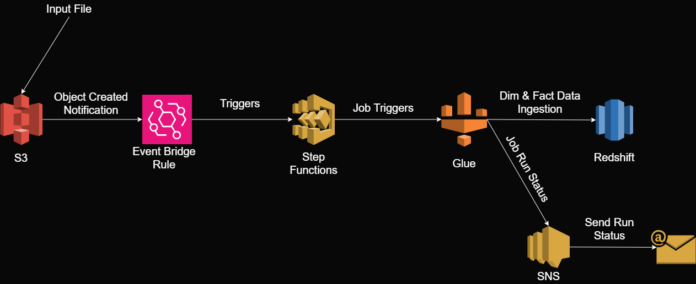
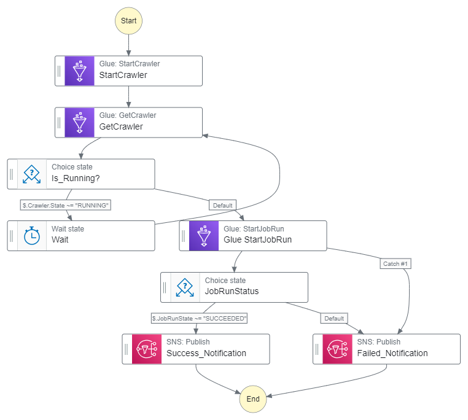

# Airline Data Ingestion on AWS | Data Engineering Project

## List of Contents
- [Introduction](#introduction)
- [Architecture](#architecture)
- [End to End Flow](#end-to-end-flow)

## Introduction

This project was created for learning purposes and the intention behind doing it was to understand how step function can be integrated with different AWS Services to create a scalable and reliable data pipeline. 

## Architecture

## End to End Flow

1. **AWS S3** - There are 2 types of data being used in the project.  
    - Airports.csv - This file contains details about each airport represented by unique Id and other details and acts as the source for the dimensional data.
    - Flights.csv - This file contains data for different flights differentiated based on the carrier along with departure and arrival delay. This is the source of the fact data.
2. **Event Bridge Rule** - As soon as the file is placed in the landing bucket, S3 will send an object notification which is used to create an event bridge rule which triggers the step function
3. **Step Functions** - 
    - A workflow is created which essentials triggers glue crawlers.
    - Post successful crawler run, a glue job is triggered which reads the dimensional data from the redshift table and uses it to enrich the fact data ultimately loading it into the Redshift.
    - After glue job is finished, the corresponding status is ingested into SNS which is pushed to email notification.
    - Graphical representation of the flow is depicted below - 
    - 